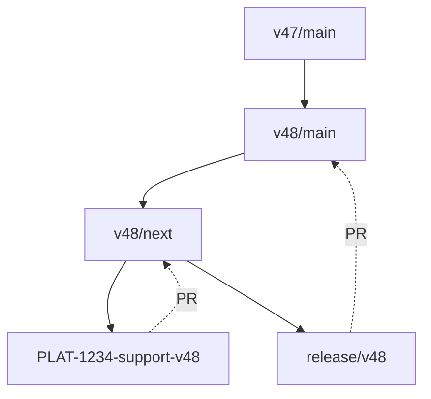

# Releasing

## Create a release branch

### Enhancements and bug fixes

- decide on a new version number, following [semantic versioning](https://semver.org/)
- create a new release branch from `vX/next` with the new version number in the branch name i.e. `git checkout -b release/vX.Y.Z`
- update the version number and date in the changelog
- make a pull request from your release branch to `vX/main` entitled "Release vX.Y.Z"
- get the pull request reviewed – all code changes should have been reviewed already, this should be a review of the integration of all changes to be shipped and the changelog
- merge the PR

⚠️ **Note**: Consider merging or cherry-picking bug fixes to other affected major version branches

### New major release

When a new Expo SDK is released, we should also publish a matching major version.

- create and push a new **main** branch for the new supported Expo version (e.g. `v48/main`) from the latest current branch (e.g. `v47/main`), checking for unreleased changes in the equivalent `next` branch (e.g. `v47/next`)
- create a new **next** branch based on the new **main** branch (e.g. `v48/next`)
- create a feature branch from which the changes to support the new version are to be made (e.g. `PLAT-1234-support-v48`)
- make the required dependency changes for the latest Expo version
- make a PR from the feature branch targeting the new **next** branch (e.g. `PLAT-1234-support-v48` to `v48/next`)
- create a release branch from **next** (e.g. `release/v48.0.0`) 
- update the version number and release date in the changelog
- make a PR from your release branch targeting the new **main** branch (e.g. `release/v48.0.0` to `v48/main`) entitled `Release v48.0.0`
- get the release PR reviewed
- merge the PR

The following diagram demonstrates the flow of creating the required branches for new SDK release:



## Publish the release

You are now ready to make the release. Releases are done using Docker. You do not need to have the release branch checked out on your local machine to make a release – the container pulls a fresh clone of the repo down from GitHub. 

### Prerequisites

- You will need to clone the repository and have Docker running on your local machine.
- Ensure you are logged in to npm and that you have access to publish in the `@bugsnag` namespace on npm
- Generate a [granular access token](https://www.npmjs.com/settings/{username}/tokens/granular-access-tokens/new) on  NPM to bypass 2FA and store it somewhere secure
- Ensure your `.gitconfig` file in your home directory is configured to contain your name and email address
- Generate a [personal access token](https://github.com/settings/tokens/new) on GitHub and store it somewhere secure
- Add the `zscaler-root-ca.crt` certificate to the root of the repository (see Zscaler documentation for details)

### Building

Before publishing your release, you must first build the release container:

`docker compose build release`

### Publishing

You may want to consider shipping a [prerelease](#prerelease) to aid testing the changes before publishing

```sh
GITHUB_USER=<your github username> \
GITHUB_ACCESS_TOKEN=<generate a personal access token> \
NPM_TOKEN=<generate a personal granular access token> \
RELEASE_BRANCH=<the branch to publish a new release from> \
VERSION=[major | minor | patch] \
DIST_TAG=latest
  docker compose run release
```

This process is interactive and will require you to confirm that you want to publish the changed packages.

**Note**: if a prerelease was made, to graduate it into a normal release you will need to use `patch` as the version.

### Final Steps

After publishing the release, the following steps must also be completed:

- create a release on GitHub https://github.com/bugsnag/bugsnag-expo-performanmce/releases/new
- use the tag vX.Y.Z as the name of the release
- copy the release notes from `CHANGELOG.md`
- publish the release
- update and push `vX/next`:
    ```sh
    git checkout v48/next
    git merge v48/main
    git push
    ```
- for new major versions, change the default branch on GitHub to the new `vX/next` branch

### Prereleases

If you are starting a new prerelease, use one of the following values for the `VERSION` variable in the release command:

```
VERSION=[premajor | preminor | prepatch]
```

For subsequent iterations on that release, use:

```
VERSION=prerelease
```

The `DIST_TAG` variable determines both:
- The prerelease identifier used in the version number (e.g., `1.0.0-beta.0`)
- The npm dist tag under which the package will be published

For example, to publish a prerelease with the `beta` dist tag:

```
GITHUB_USER=<your github username> \
GITHUB_ACCESS_TOKEN=<generate a personal access token> \
NPM_TOKEN=<generate a personal granular access token> \
RELEASE_BRANCH=<the branch to publish a new release from> \
VERSION=preminor \
DIST_TAG=beta \
  docker compose run release
```

This will create a version like `1.1.0-beta.0` and publish it to npm with the `beta` dist tag.

The dist tag ensures that prereleases are not installed by unsuspecting users who do not specify a version – npm automatically adds the `latest` tag to a published module unless one is specified.
